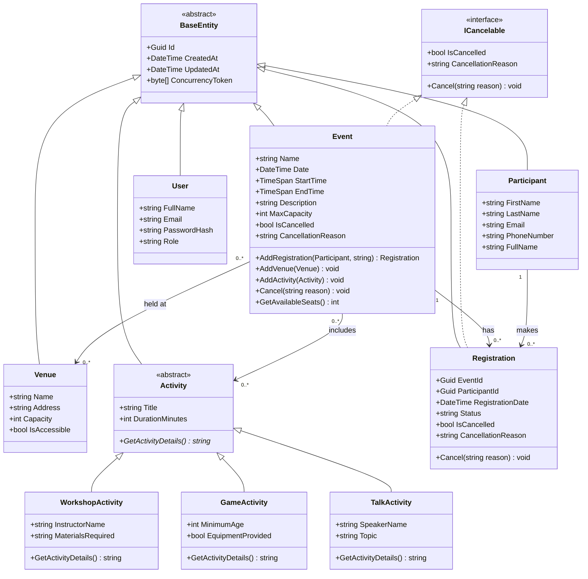

# UML Class Diagram — Community Event Management System

This class diagram shows the domain model: the abstract `BaseEntity` base class that every
entity inherits from, the `ICancelable` interface implemented by both `Event` and `Registration`
(interface polymorphism), and the abstract `Activity` class with its three subclasses
(inheritance polymorphism). It also shows the relationships, including the two many-to-many links
and the `Registration` association class.



## How to render this diagram

1. Copy everything between the ```mermaid fences (or open this file in an editor that renders
   Mermaid, such as Visual Studio Code with the Mermaid extension, or GitHub).
2. Alternatively paste it into <https://mermaid.live> and export it as a PNG to paste into the
   Word document.
