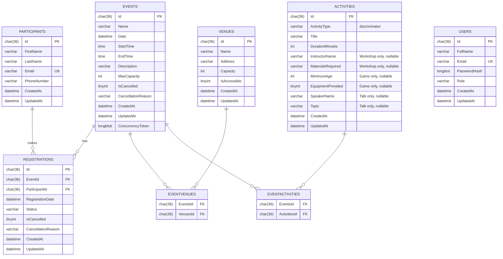

# Entity Relationship Diagram (ERD) — Database Schema

This ERD shows the actual database tables that Entity Framework Core creates from my model. Note
that all three activity subclasses are stored in the single `ACTIVITIES` table using the
Table-Per-Hierarchy strategy, with an `ActivityType` discriminator column and nullable columns for
the subclass-specific fields. The two many-to-many relationships are resolved by the junction
tables `EVENTVENUES` and `EVENTACTIVITIES`, and the `REGISTRATIONS` table is the join between
events and participants that also carries its own data.

> Note: `REGISTRATIONS` has a unique index on `(EventId, ParticipantId)` so the same participant
> cannot have two active registrations for the same event.
