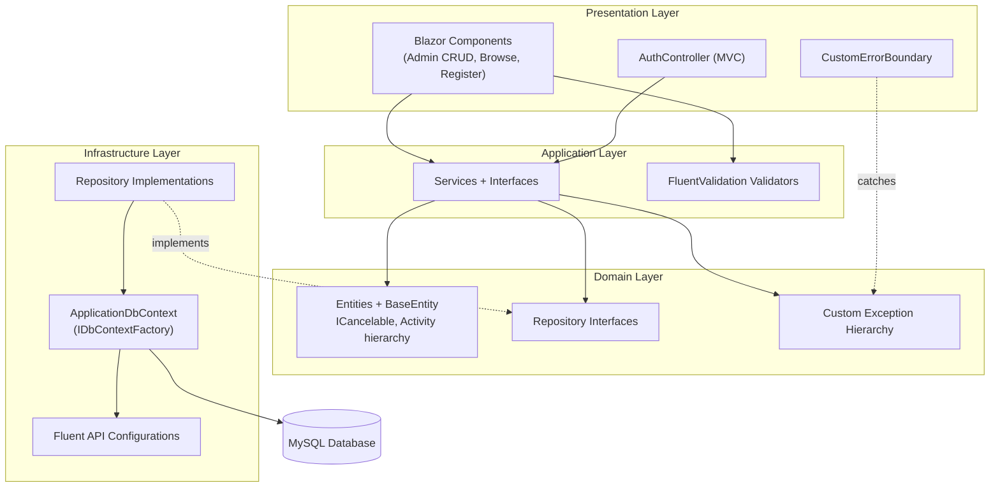

# Layered Architecture Diagram

Shows the four layers and their dependencies. The Application layer depends on the repository
*interfaces* in the Domain layer, and the Infrastructure layer *implements* them (dashed arrow) —
the Repository pattern with dependency inversion.

