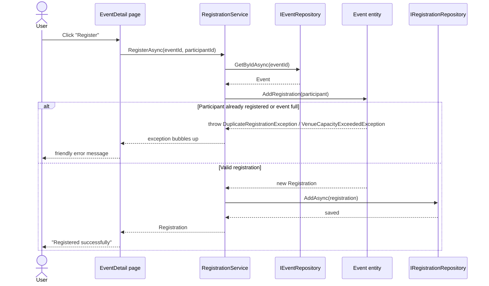

# Registration Sequence Diagram

Shows the dynamic behaviour of registering a participant, including the path where a business rule
is broken and a custom exception is thrown and handled.

```mermaid
sequenceDiagram
    actor User
    participant Page as EventDetail page
    participant Svc as RegistrationService
    participant ERepo as IEventRepository
    participant Evt as Event entity
    participant RRepo as IRegistrationRepository

    User->>Page: Click "Register"
    Page->>Svc: RegisterAsync(eventId, participantId)
    Svc->>ERepo: GetByIdAsync(eventId)
    ERepo-->>Svc: Event
    Svc->>Evt: AddRegistration(participant)

    alt Participant already registered or event full
        Evt-->>Svc: throw DuplicateRegistrationException / VenueCapacityExceededException
        Svc-->>Page: exception bubbles up
        Page-->>User: friendly error message
    else Valid registration
        Evt-->>Svc: new Registration
        Svc->>RRepo: AddAsync(registration)
        RRepo-->>Svc: saved
        Svc-->>Page: Registration
        Page-->>User: "Registered successfully"
    end
```
