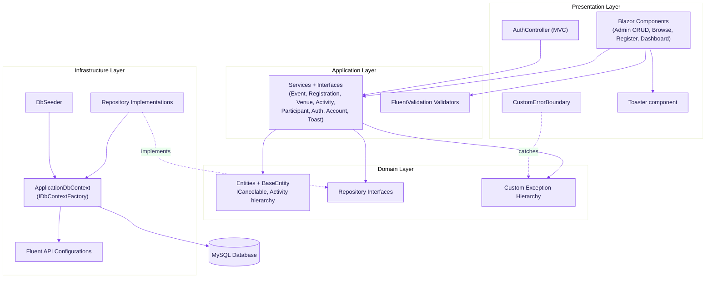
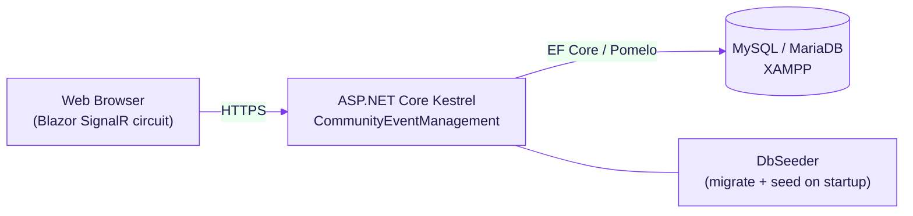

# COMMUNITY EVENT MANAGEMENT SYSTEM (CEMS)

## SYSTEM DESIGN & ARCHITECTURE — DOCUMENT v1.0

**Document Status:** ✅ FINALISED &nbsp;|&nbsp; **Release:** v1.0 &nbsp;|&nbsp; **Last Updated:** June 9, 2026
**Module:** CET254 Advanced Programming — Assignment 1 &nbsp;|&nbsp; **Author:** Sagar Thapa (bi95ss)
**Classification:** Academic Submission — University of Sunderland

---

## EXECUTIVE SUMMARY

The Community Event Management System (CEMS) is a server-rendered web application built with **.NET 10
Blazor (Interactive Server)**, **Entity Framework Core 9** and **MySQL**. It is organised using a
**four-layer Clean Architecture** so that the business rules sit at the centre, free of any
dependency on the database or the user interface. The design deliberately demonstrates a range of
object-oriented techniques and recognised design patterns, while keeping every layer independently
testable (proven by the 93-test automated suite).

**Architectural goals**

- **Separation of concerns** — UI, business logic, domain and data access are distinct layers.
- **Dependency inversion** — inner layers define interfaces; outer layers implement them.
- **Testability** — because logic depends on interfaces, it can be unit-tested with mocks and an
  in-memory database.
- **Maintainability & extensibility** — new entities or activity types can be added with minimal
  change to existing code.

---

## 1. ARCHITECTURAL OVERVIEW

CEMS follows a layered (onion/clean) architecture. Dependencies point **inwards** only: the
Presentation and Infrastructure layers depend on the Application and Domain layers, never the other
way around. The Application layer depends on repository **interfaces** that live in the Domain layer,
and the Infrastructure layer **implements** those interfaces — this is the Dependency Inversion
Principle in action and is what makes the system so testable.

### Layer responsibilities and evidence

| Layer | Responsibility | Representative files |
|-------|----------------|----------------------|
| **Domain** | Pure business model — entities, business rules, interfaces, custom exceptions. No external dependencies. | `Domain/Entities/*.cs`, `Domain/Interfaces/*.cs`, `Domain/Exceptions/*.cs` |
| **Application** | Orchestration of use cases, business-logic services, input validation. | `Application/Services/*.cs`, `Application/Validators/*.cs` |
| **Infrastructure** | EF Core persistence, Fluent API mapping, repositories, seeding. | `Infrastructure/Data/ApplicationDbContext.cs`, `Infrastructure/Data/Configurations/*.cs`, `Infrastructure/Repositories/*.cs`, `Infrastructure/Data/DbSeeder.cs` |
| **Presentation** | Blazor components/pages, the MVC `AuthController`, view models, error boundary, toasts. | `Components/**`, `Controllers/AuthController.cs`, `Models/ViewModels/*.cs` |

---

## 2. DESIGN PATTERNS APPLIED

Each pattern below is used deliberately and can be pointed to in the code during the demonstration.

| Pattern | Where | Why it was chosen |
|---------|-------|-------------------|
| **Repository** | `Domain/Interfaces/I*Repository.cs` + `Infrastructure/Repositories/*Repository.cs` | Hides EF Core behind an interface so the Application layer never touches the `DbContext` directly; enables SQLite-in-memory testing. |
| **Service Layer** | `Application/Services/*.cs` | Keeps business logic out of the UI; one place for each use case (e.g. `RegistrationService.RegisterAsync`). |
| **Factory** | `IDbContextFactory<ApplicationDbContext>` registered via `AddDbContextFactory` in `Program.cs` | Blazor Server circuits are long-lived and render concurrently; a factory hands each operation a fresh, short-lived `DbContext` instead of sharing one (the safe Blazor Server pattern). |
| **Observer** | `Application/Services/ToastService.cs` (`OnChange` event) + `Components/Shared/Toaster.razor` (subscriber) | Decouples "something happened" from "show a toast"; any page can raise a notification and the `Toaster` reacts. |
| **Template Method / Polymorphism** | `Domain/Entities/Activity.cs` abstract `GetActivityDetails()` overridden by `WorkshopActivity`, `GameActivity`, `TalkActivity` | Each activity type formats its own details while sharing the common `Activity` contract. |
| **Strategy (via DI)** | `IValidator<T>` validators resolved by FluentValidation | The correct validation strategy is selected per view-model at runtime through dependency injection. |
| **Dependency Injection** | `Program.cs` (`AddScoped` for every interface) | The composition root wires interfaces to implementations; classes receive their collaborators through constructors. |
| **Association (Join) Entity** | `Domain/Entities/Registration.cs` | `Registration` is more than a join row — it carries its own state (`Status`, `RegistrationDate`) and behaviour (`Cancel`). |

---

## 3. REQUEST / DATA FLOW

A typical write operation (e.g. an administrator creating an event) flows through the layers like
this:

1. **Presentation** — the Blazor `EventForm` collects input into an `EventViewModel`; a
   `<FluentValidationValidator />` validates it client-side and server-side.
2. **Application** — `EventService.CreateEventAsync(vm)` builds a domain `Event` via its public
   constructor and calls the repository.
3. **Infrastructure** — `EventRepository.AddAsync(...)` opens a fresh `DbContext` from the factory,
   attaches the venues/activities, and saves.
4. **Domain rules** — business rules live inside the entities (e.g. `Event.AddRegistration` enforces
   capacity and duplicate rules), so they cannot be bypassed by any caller.
5. **Feedback** — on success the page raises `IToastService.ShowSuccess(...)`; on a thrown domain
   exception, `CustomErrorBoundary` converts it to a friendly message.

---

## 4. CROSS-CUTTING CONCERNS

| Concern | Approach | Evidence |
|---------|----------|----------|
| **Authentication** | Cookie authentication (`AddAuthentication`/`AddCookie`); login form posts to an MVC `AuthController`; passwords hashed with **BCrypt**. | `Program.cs` (auth setup), `Controllers/AuthController.cs`, `Application/Services/AuthService.cs` |
| **Authorisation** | Role-based — `Administrator` vs self-service `User`; navigation and pages adapt to the signed-in role via cascading `AuthenticationState`. | `Components/Layout/NavMenu.razor`, `Components/Pages/User/*` |
| **Validation** | FluentValidation with cross-property and conditional rules, registered as `IValidator<T>`. | `Application/Validators/*.cs`, `Program.cs` |
| **Exception handling** | Custom exception hierarchy thrown in the domain/service layer; `CustomErrorBoundary` catches and renders friendly messages; global `/Error` and `/not-found` pages. | `Domain/Exceptions/*.cs`, `Components/Layout/CustomErrorBoundary.razor`, `Program.cs` |
| **Concurrency** | Optimistic concurrency via `BaseEntity.ConcurrencyToken` configured with `.IsConcurrencyToken()` (portable across MySQL and the SQLite test database). | `Domain/Entities/BaseEntity.cs`, `Infrastructure/Data/Configurations/*.cs` |
| **Persistence safety** | `IDbContextFactory` + `using var context` per operation prevents shared-context bugs on a Blazor Server circuit. | `Program.cs`, `Infrastructure/Repositories/*.cs` |

---

## 5. TECHNOLOGY STACK

| Area | Technology | Notes |
|------|------------|-------|
| Runtime / language | .NET 10, C# 13 (`<LangVersion>13</LangVersion>`) | Latest LTS-track runtime |
| UI | Blazor Web App — Interactive Server render mode | Server-side rendering with SignalR circuit |
| ORM | Entity Framework Core 9 | Code-first, migrations, Fluent API |
| Database | MySQL / MariaDB 10.4.32 (XAMPP) via **Pomelo.EntityFrameworkCore.MySql 9.0** | SQLite used in-memory for tests |
| Authentication | ASP.NET Core Cookie Authentication + **BCrypt.Net-Next** | Hashed, salted passwords |
| Validation | **FluentValidation** + Blazored.FluentValidation | Cross-property + conditional rules |
| Testing | xUnit, SQLite in-memory, Moq, bUnit, FluentValidation.TestHelper, **Microsoft.Playwright** (E2E) | 93 unit/integration/component tests + E2E layer |
| Patterns/DI | Built-in Microsoft.Extensions.DependencyInjection | Scoped lifetimes for repos/services |

---

## 6. DEPLOYMENT VIEW

On startup the application creates a DI scope and runs `DbSeeder.SeedAsync`, which applies migrations
(creating the schema if needed) and inserts the default admin account, a demo user and sample data.

---

## 7. KEY DESIGN DECISIONS & RATIONALE

| Decision | Choice | Rationale |
|----------|--------|-----------|
| Primary keys | `Guid` on an abstract `BaseEntity` | Consistent identity for every entity; avoids identity-insert coupling. |
| Activity modelling | Abstract class + 3 subclasses (TPH) instead of a `Type` string | Real inheritance & polymorphism; type-safe subclass fields. |
| Cancellation | `ICancelable` interface on `Event` **and** `Registration` | One contract, two behaviours → interface polymorphism; soft-cancel keeps history. |
| Registration key | Own `Guid` PK + **unique index** on `(EventId, ParticipantId)` | More flexible than a composite key, still prevents duplicate active bookings. |
| Concurrency token | `.IsConcurrencyToken()` not `.IsRowVersion()` | Portable across MySQL (production) and SQLite (tests). |
| DbContext lifetime | `AddDbContextFactory` (not `AddDbContext`) | Safe for concurrent rendering on a Blazor Server circuit. |
| Account model | `User` linked to `Participant` by e-mail | Separates authentication from domain data. |
| Cancellation idempotency | `Event.Cancel()` guards `if (IsCancelled) return` | The original cancellation reason cannot be silently overwritten by a second call. |

---

## 8. QUALITY ATTRIBUTES (NON-FUNCTIONAL)

- **Performance** — debounced (400 ms) search builds an `IQueryable` so only the chosen filters hit
  the database; queries are `async` end-to-end.
- **Reliability** — every risky operation is guarded by validation + custom exceptions, and the
  error boundary prevents raw stack traces from ever reaching the user.
- **Usability** — a professional SaaS-grade UI (violet/indigo design system, reusable components,
  toasts, skeleton loaders, responsive + accessible).
- **Maintainability** — strict layering, interface-based dependencies and a comprehensive test suite.

---

**Document Version:** 1.0 &nbsp;|&nbsp; **Status:** ✅ FINALISED &nbsp;|&nbsp; **Author:** Sagar Thapa (bi95ss)
&nbsp;|&nbsp; **Module:** CET254 Advanced Programming
