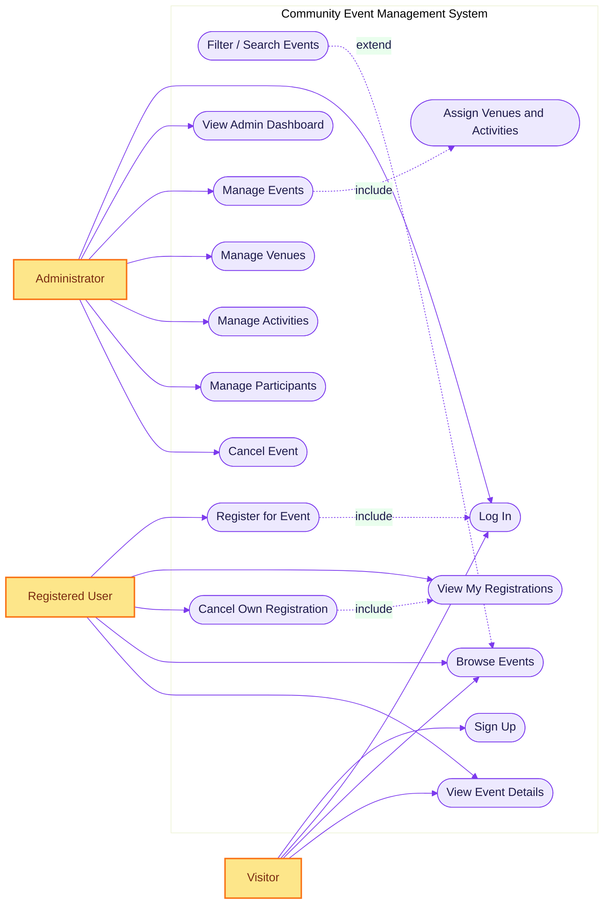
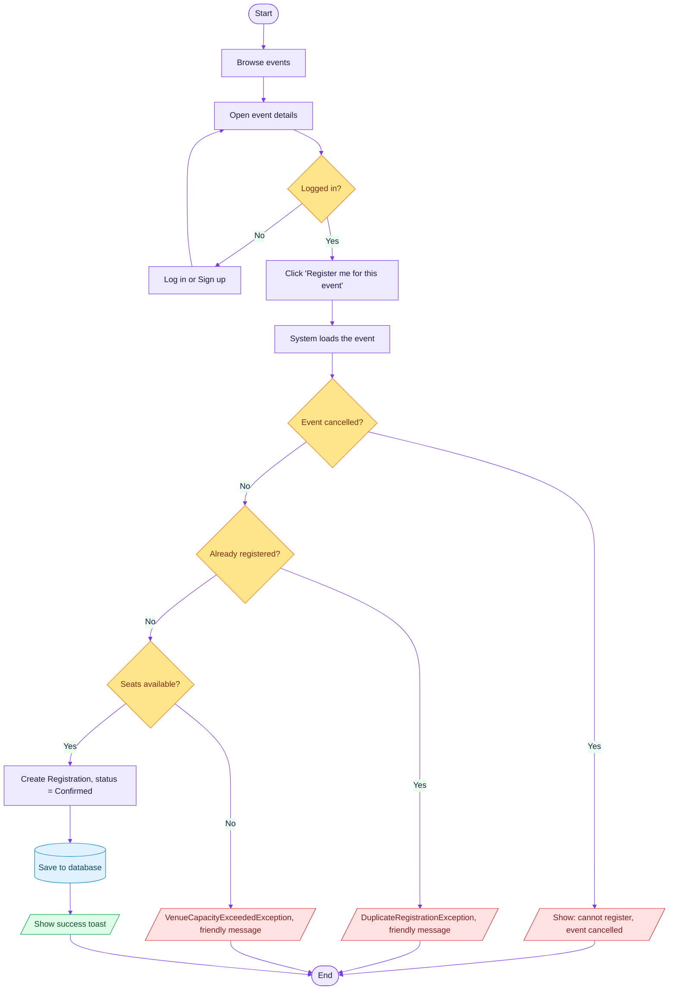
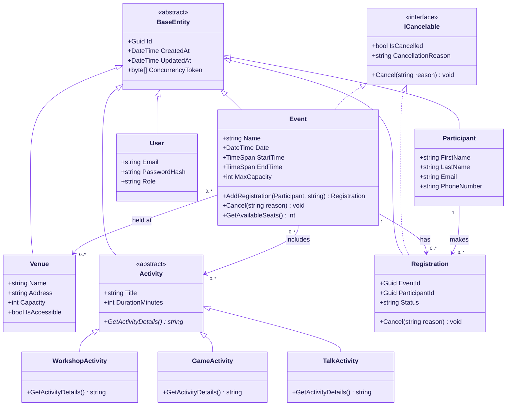
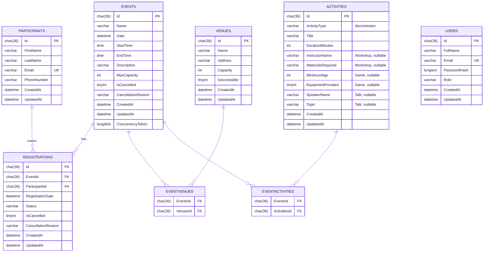
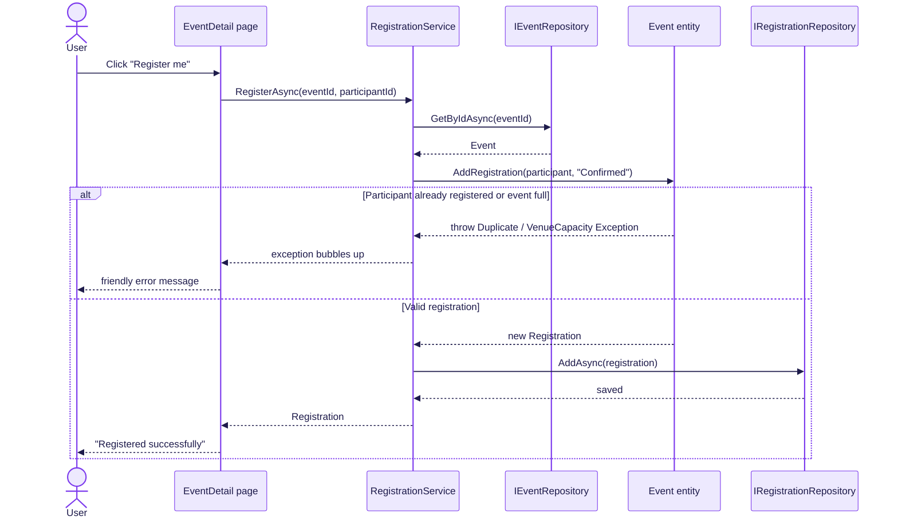

# COMMUNITY EVENT MANAGEMENT SYSTEM (CEMS)

## UML DESIGN MODELS — DOCUMENT v1.0

**Document Status:** ✅ FINALISED &nbsp;|&nbsp; **Release:** v1.0 &nbsp;|&nbsp; **Last Updated:** June 8, 2026
**Module:** CET254 Advanced Programming — Assignment 1 &nbsp;|&nbsp; **Author:** Sagar Thapa (bi95ss)
**Classification:** Academic Submission — University of Sunderland

---

## EXECUTIVE SUMMARY

This document presents the complete set of Unified Modelling Language (UML) models for the
**Community Event Management System (CEMS)**, a .NET 10 Blazor web application that lets a community
organisation manage events, the venues those events run at, the activities they include, the
participants who attend and the registrations that link participants to events.

The models are grouped into the two standard UML viewpoints:

| Viewpoint | Diagram | Purpose |
|-----------|---------|---------|
| **Behavioural** | Use-Case Diagram | What the actors can do with the system |
| **Behavioural** | Activity Diagram | The step-by-step flow of the "Register for an event" process |
| **Behavioural** | Sequence Diagram | The runtime message exchange for a registration, including the failure path |
| **Structural** | Class Diagram (without relationships) | The classes, attributes and operations in isolation |
| **Structural** | Class Diagram (with relationships) | The same classes plus inheritance, interface realisation and associations |
| **Structural** | Entity Relationship Diagram (ERD) | The physical database tables EF Core generates |

> **Rendering / exporting note.** Every diagram below is written in [Mermaid](https://mermaid.js.org/)
> and is rendered automatically by GitHub, Visual Studio Code (Markdown Preview Mermaid extension)
> and Obsidian. To produce a PNG for the Word submission, open the diagram in
> <https://mermaid.live>, paste the fenced code and use **Actions → PNG**. A consistent
> violet/indigo theme directive (`%%{init...}%%`) is applied to every diagram so the whole set looks
> like one cohesive, professional model. The PNG exports referenced by `CET254_Documentation.html`
> are `class-diagram.png`, `erd.png`, `sequence-registration.png`, plus the three new exports
> `use-case-diagram.png`, `activity-diagram.png` and `class-diagram-no-relationships.png`.

---

## 1. USE-CASE DIAGRAM

The use-case diagram shows the three **actors** and every **use case** they can perform inside the
system boundary. There are two authenticated roles — the self-service **Registered User** and the
**Administrator** — plus the unauthenticated **Visitor**.

Two UML relationships are modelled:

- **«include»** — a base use case always uses another. *Register for Event* includes *Log In*
  (you must be authenticated to register); *Manage Events* includes *Assign Venues and Activities*;
  *Cancel Own Registration* includes *View My Registrations*.
- **«extend»** — an optional behaviour that adds to a base use case. *Filter / Search Events*
  extends *Browse Events* (filtering is an optional refinement of browsing).

**Actors and their goals**

| Actor | Goal | Key use cases |
|-------|------|---------------|
| Visitor | Discover events and create an account | Sign Up, Log In, Browse Events, View Event Details |
| Registered User | Self-service: join events and manage own bookings | Register for Event, View My Registrations, Cancel Own Registration, Filter Events |
| Administrator | Run the back office | Manage Events / Venues / Activities / Participants, Assign Venues & Activities, Cancel Event, View Dashboard |

---

## 2. ACTIVITY DIAGRAM — "Register for an Event"

The activity diagram models the most important business process: a user registering themselves for
an event. It shows the **control flow**, the **decision (guard) nodes** and — crucially — the three
points where a broken business rule raises a **custom exception** that is turned into a friendly
message. Responsibility partitions are shown by colour: violet = user/system actions,
amber = decisions, red = error/exception outcomes, green = success, blue = database.

The three guard nodes map directly to real code in `RegistrationService.RegisterAsync(...)` and
`Event.AddRegistration(...)`: the cancelled-event check throws an `EventManagementException`, the
duplicate check throws a `DuplicateRegistrationException`, and the capacity check throws a
`VenueCapacityExceededException`.

---

## 3. CLASS DIAGRAM — WITHOUT RELATIONSHIPS

This first structural view lists every domain class on its own, with its **attributes** and
**operations**, so the internal makeup of each class is clear before the relationships are layered
on. Note the stereotypes: `«abstract»` on `BaseEntity` and `Activity`, and `«interface»` on
`ICancelable`. The `*` after `GetActivityDetails()*` marks it as an abstract operation.

```mermaid
%%{init: {'theme':'base','themeVariables':{'primaryColor':'#ede9fe','primaryBorderColor':'#7c3aed','primaryTextColor':'#1e1b4b','lineColor':'#7c3aed'}}}%%
classDiagram
    direction LR

    class BaseEntity {
        <<abstract>>
        +Guid Id
        +DateTime CreatedAt
        +DateTime UpdatedAt
        +byte[] ConcurrencyToken
    }
    class ICancelable {
        <<interface>>
        +bool IsCancelled
        +string CancellationReason
        +Cancel(string reason) void
    }
    class Event {
        +string Name
        +DateTime Date
        +TimeSpan StartTime
        +TimeSpan EndTime
        +string Description
        +int MaxCapacity
        +bool IsCancelled
        +AddRegistration(Participant, string) Registration
        +AddVenue(Venue) void
        +AddActivity(Activity) void
        +Cancel(string reason) void
        +GetAvailableSeats() int
    }
    class Participant {
        +string FirstName
        +string LastName
        +string Email
        +string PhoneNumber
        +string FullName
    }
    class Venue {
        +string Name
        +string Address
        +int Capacity
        +bool IsAccessible
    }
    class Activity {
        <<abstract>>
        +string Title
        +int DurationMinutes
        +GetActivityDetails()* string
    }
    class WorkshopActivity {
        +string InstructorName
        +string MaterialsRequired
        +GetActivityDetails() string
    }
    class GameActivity {
        +int MinimumAge
        +bool EquipmentProvided
        +GetActivityDetails() string
    }
    class TalkActivity {
        +string SpeakerName
        +string Topic
        +GetActivityDetails() string
    }
    class Registration {
        +Guid EventId
        +Guid ParticipantId
        +DateTime RegistrationDate
        +string Status
        +bool IsCancelled
        +Cancel(string reason) void
    }
    class User {
        +string FullName
        +string Email
        +string PasswordHash
        +string Role
    }
```

---

## 4. CLASS DIAGRAM — WITH RELATIONSHIPS

This is the full domain model. It adds every relationship on top of the classes above:

- **Generalisation (inheritance)** — every entity inherits the abstract `BaseEntity`; the three
  activity subclasses inherit the abstract `Activity` (`◁—`, solid line, hollow triangle).
- **Realisation (interface)** — both `Event` and `Registration` implement `ICancelable`
  (`◁┈`, dashed line, hollow triangle). The same interface, two different `Cancel()` behaviours, is
  the project's clearest example of **interface polymorphism**.
- **Associations with multiplicity** — one `Event` has many `Registration`s; one `Participant`
  makes many `Registration`s (so `Registration` is the association/join entity); `Event` ↔ `Venue`
  and `Event` ↔ `Activity` are both many-to-many.

---

## 5. ENTITY RELATIONSHIP DIAGRAM (ERD)

The ERD shows the **physical database** that EF Core 9 generates from the model. Three important
mapping decisions are visible:

1. **Table-Per-Hierarchy (TPH)** — all three activity subclasses live in a single `ACTIVITIES`
   table with an `ActivityType` discriminator column and nullable subclass-specific columns.
2. **Many-to-many junctions** — `EVENTVENUES` and `EVENTACTIVITIES` resolve the two M:N links.
3. **Registration as a join entity** — `REGISTRATIONS` is the join between events and participants
   but carries its own data (`RegistrationDate`, `Status`), and has a **unique index on
   `(EventId, ParticipantId)`** so the same participant cannot hold two active bookings for one event.

> `USERS` deliberately has no foreign key to `PARTICIPANTS`. A self-service account (`User`) is
> linked to its `Participant` record by **matching e-mail address** at the application layer, which
> keeps authentication concerns separate from the domain data.

---

## 6. SEQUENCE DIAGRAM — "Register for an Event"

The sequence diagram shows the **dynamic** runtime behaviour: the messages exchanged between the
Blazor page, the service, the repositories and the `Event` entity. The `alt` fragment models both
outcomes — the **exception path** (a broken rule bubbles up to a friendly message) and the **happy
path** (a new registration is saved). This mirrors the activity diagram in section 2 but at the
object-interaction level.

---

## TRACEABILITY — DIAGRAMS TO CODE

Every model is taken directly from the implementation, so the documentation and the solution stay in
step:

| Diagram | Primary source files |
|---------|----------------------|
| Use Case | `Components/Pages/**` (Admin CRUD, `User/EventList`, `User/EventDetail`, `User/MyRegistrations`, `SignUp`, `Login`) |
| Activity | `Application/Services/RegistrationService.cs`, `Domain/Entities/Event.cs` |
| Class (both) | `Domain/Entities/*.cs`, `Domain/Entities/ICancelable.cs` |
| ERD | `Infrastructure/Data/Configurations/*.cs`, `Infrastructure/Data/ApplicationDbContext.cs` |
| Sequence | `Components/Pages/User/EventDetail.razor`, `Application/Services/RegistrationService.cs`, `Domain/Entities/Event.cs` |

---

**Document Version:** 1.0 &nbsp;|&nbsp; **Status:** ✅ FINALISED &nbsp;|&nbsp; **Author:** Sagar Thapa (bi95ss)
&nbsp;|&nbsp; **Module:** CET254 Advanced Programming
